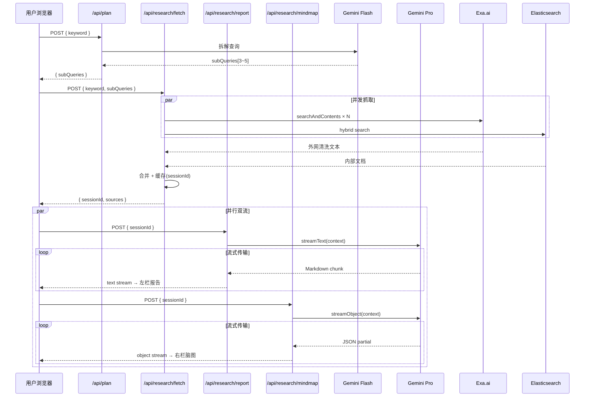
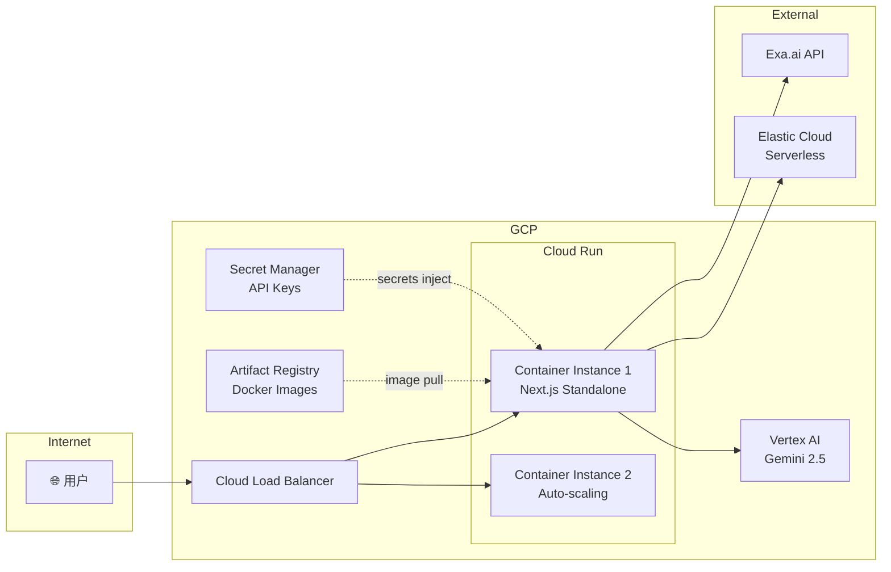

# G-RapidAgent 设计文档

> **日期**: 2026-06-07
> **团队**: 2 人
> **工期**: 4 天
> **目标**: 谷歌云黑客松参赛项目

## 1. 项目概述

G-RapidAgent 是一个关键词型流式分析智能体。用户输入任意探究性关键词后，系统自动触发以下流水线：

```
用户关键词 → Gemini 规划子查询 → Exa 语义并发抓取 → Elasticsearch 混合检索 → Gemini 并行流式输出（Markdown 报告 + 思维导图 JSON）
```

### 系统架构总览

```mermaid
graph TB
    subgraph "👤 用户浏览器"
        UI[React 19 + TailwindCSS]
        SR[StreamingReport<br/>Markdown 流式渲染]
        MM[MindMap<br/>react-d3-tree 动态可视化]
    end

    subgraph "🖥️ Next.js 16 App Router (Cloud Run)"
        subgraph "API Routes"
            PLAN["/api/plan<br/>Query Planner"]
            FETCH["/api/research/fetch<br/>数据抓取 & 缓存"]
            REPORT["/api/research/report<br/>报告流式生成"]
            MINDMAP["/api/research/mindmap<br/>脑图流式生成"]
        end
        CACHE[(Session Cache<br/>内存 Map)]
    end

    subgraph "☁️ 外部服务"
        FLASH[Gemini 2.5 Flash<br/>查询拆解]
        PRO[Gemini 2.5 Pro<br/>深度分析 & 结构化输出]
        EXA[Exa.ai<br/>语义搜索 + 正文清洗]
        ES[Elasticsearch Serverless<br/>内部知识库 RRF 混合检索]
    end

    UI -->|1. POST keyword| PLAN
    PLAN -->|生成 3~5 子查询| FLASH
    FLASH -->|subQueries[]| PLAN
    PLAN -->|返回 subQueries| UI

    UI -->|2. POST subQueries| FETCH
    FETCH -->|并发语义搜索| EXA
    FETCH -->|混合检索| ES
    EXA -->|清洗文本| FETCH
    ES -->|内部文档| FETCH
    FETCH -->|sessionId + sources| UI
    FETCH -->|缓存 context| CACHE

    UI -->|3a. POST sessionId| REPORT
    UI -->|3b. POST sessionId| MINDMAP
    REPORT -->|读取 context| CACHE
    MINDMAP -->|读取 context| CACHE
    REPORT -->|streamText()| PRO
    MINDMAP -->|streamObject()| PRO
    PRO -->|Markdown 流| REPORT
    PRO -->|JSON 流| MINDMAP
    REPORT -->|text stream| SR
    MINDMAP -->|object stream| MM
```

### 请求时序图



### 部署架构图



## 2. 技术选型

| 层级 | 选型 | 理由 |
|------|------|------|
| 框架 | Next.js 16 App Router | RSC + Turbopack，一键容器化 |
| 前端 | TypeScript + React 19 | 类型安全 + 高频状态更新 |
| 样式 | TailwindCSS | 快速响应式开发 |
| 动效 | Framer Motion | 流式"生长"动画 |
| 推理 | Gemini 2.5 (Pro + Flash) | Flash 做 planner，Pro 做深度分析 |
| 外网抓取 | Exa.ai | 语义搜索 + 自动正文清洗 |
| 内网检索 | Elasticsearch Serverless | RRF 混合检索私有数据 |
| 可视化 | react-d3-tree | 强类型 JSON → 交互式思维导图 |
| 部署 | GCP Cloud Run | min-instances=1，低冷启动 |

## 3. 方案选择

选定**方案 A：Next.js 全栈单体 → Cloud Run**。

理由：
- 2 人团队零协调开销
- 4 天内完全可交付
- Hackathon 评审时单一 URL，体验一致

## 4. 项目结构

```
G-RapidAgent/
├── app/
│   ├── layout.tsx
│   ├── page.tsx                 # 首页搜索
│   ├── research/page.tsx        # 结果页（双栏流式）
│   └── api/
│       ├── plan/route.ts        # 查询规划
│       └── research/
│           ├── fetch/route.ts   # Exa + ES 抓取 & 缓存
│           ├── report/route.ts  # Markdown 报告流
│           └── mindmap/route.ts # 思维导图 JSON 流
├── components/
│   ├── SearchInput.tsx
│   ├── StreamingReport.tsx
│   ├── MindMap.tsx
│   ├── MindMapNode.tsx
│   ├── LoadingStates.tsx
│   └── SourceCard.tsx
├── lib/
│   ├── exa.ts
│   ├── elasticsearch.ts
│   ├── gemini.ts
│   └── schemas.ts
├── Dockerfile
├── .env.example
├── package.json
├── tailwind.config.ts
└── next.config.ts
```

## 5. API 设计

### 5.1 `POST /api/plan`
- **输入**: `{ keyword: string }`
- **输出**: `{ subQueries: string[] }` (3~5 条)
- **模型**: Gemini 2.5 Flash

### 5.2 `POST /api/research/fetch`
- **输入**: `{ keyword: string, subQueries: string[] }`
- **输出**: `{ sessionId: string, sources: Source[] }`
- **逻辑**: 并发 Exa 抓取 + ES 混合检索，结果缓存到内存 Map

### 5.3 `POST /api/research/report`（流式）
- **输入**: `{ sessionId: string }`
- **输出**: text stream (Markdown)
- **模型**: Gemini 2.5 Pro via `streamText()`

### 5.4 `POST /api/research/mindmap`（流式）
- **输入**: `{ sessionId: string }`
- **输出**: object stream (mindMapSchema JSON)
- **模型**: Gemini 2.5 Pro via `streamObject()`

前端并发发起 report + mindmap 两个流，实现双栏同时渲染。

## 6. 数据流时序

```
1. 用户输入关键词 → 前端调 /api/plan
2. 获得 subQueries → 前端调 /api/research/fetch
3. 获得 sessionId → 前端并发调:
   - /api/research/report?sessionId=xxx  → StreamingReport 组件
   - /api/research/mindmap?sessionId=xxx → MindMap 组件
4. 用户实时看到左侧报告"打字" + 右侧脑图"生长"
```

## 7. 前端 UI 设计

- **首页**: 极简搜索框居中，Google 风格
- **结果页**: 左右分栏（桌面）/ 上下堆叠（平板）/ Tab 切换（移动端）
- **主题**: 深色科技风，accent 使用 Google Blue (#4285F4)
- **动效**: Framer Motion 驱动所有流式入场动画

## 8. 部署方案

- Docker multi-stage build
- Cloud Run: min-instances=1, max-instances=10
- 环境变量通过 Secret Manager 注入

## 9. 实施路线图（4 天）

| 天数 | Person A（后端） | Person B（前端） | 里程碑 |
|:----:|:---|:---|:---|
| D1 | 初始化、/api/plan、Exa 接入 | 初始化、首页 UI、SearchInput | Plan API 可用 + 首页 |
| D2 | /api/research/fetch、ES 混合检索、/report | StreamingReport、Markdown 渲染、加载动效 | 报告流跑通 |
| D3 | /api/research/mindmap、session 缓存、错误处理 | MindMap 组件、节点动画、双栏联调 | 双流完整 |
| D4 | Dockerfile、Cloud Run 部署、性能调优 | 响应式适配、来源卡片、打磨 | 上线 + Demo |

## 10. 风险缓解

| 风险 | 缓解策略 |
|------|----------|
| Exa 额度/速率限制 | fallback 到仅 ES 数据 |
| Gemini 流式超时 | 30s timeout + graceful degradation |
| Cloud Run 冷启动 | min-instances: 1 + 预热 |
| ES 集成超时 | D3 feature，超时则跳过 |
