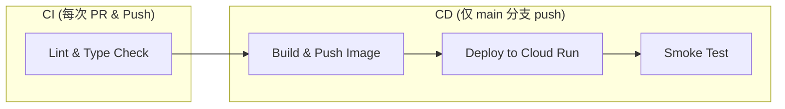

# GitHub Actions CI/CD 配置说明

## 流水线概述



| Job | 触发条件 | 作用 |
|-----|----------|------|
| **Lint** | 所有 PR + push | TypeScript 类型检查 + ESLint |
| **Build** | 仅 main push | 构建 Docker 镜像 → 推送 Artifact Registry |
| **Deploy** | Build 成功后 | 部署到 Cloud Run |
| **Smoke Test** | Deploy 成功后 | 验证服务可访问 + API 可用 |

## 需要配置的 GitHub Secrets

在仓库 Settings → Secrets and variables → Actions 中添加：

| Secret 名称 | 说明 | 如何获取 |
|---|---|---|
| `GCP_PROJECT_ID` | GCP 项目 ID | `gcloud config get-value project` |
| `WIF_PROVIDER` | Workload Identity Federation Provider | 见下方配置步骤 |
| `WIF_SERVICE_ACCOUNT` | 部署用服务账号 | 见下方配置步骤 |

## 配置 Workload Identity Federation（推荐，无需 JSON Key）

```bash
# 1. 创建服务账号
gcloud iam service-accounts create github-deployer \
  --display-name="GitHub Actions Deployer"

# 2. 授予必要角色
PROJECT_ID=$(gcloud config get-value project)
SA_EMAIL="github-deployer@${PROJECT_ID}.iam.gserviceaccount.com"

gcloud projects add-iam-policy-binding $PROJECT_ID \
  --member="serviceAccount:$SA_EMAIL" \
  --role="roles/run.admin"

gcloud projects add-iam-policy-binding $PROJECT_ID \
  --member="serviceAccount:$SA_EMAIL" \
  --role="roles/artifactregistry.writer"

gcloud projects add-iam-policy-binding $PROJECT_ID \
  --member="serviceAccount:$SA_EMAIL" \
  --role="roles/iam.serviceAccountUser"

gcloud projects add-iam-policy-binding $PROJECT_ID \
  --member="serviceAccount:$SA_EMAIL" \
  --role="roles/secretmanager.secretAccessor"

# 3. 创建 Workload Identity Pool
gcloud iam workload-identity-pools create "github-pool" \
  --location="global" \
  --display-name="GitHub Actions Pool"

# 4. 创建 Provider（替换 YOUR_GITHUB_ORG/YOUR_REPO）
gcloud iam workload-identity-pools providers create-oidc "github-provider" \
  --location="global" \
  --workload-identity-pool="github-pool" \
  --display-name="GitHub Provider" \
  --attribute-mapping="google.subject=assertion.sub,attribute.repository=assertion.repository" \
  --issuer-uri="https://token.actions.githubusercontent.com"

# 5. 授权 GitHub 仓库使用该服务账号
gcloud iam service-accounts add-iam-policy-binding $SA_EMAIL \
  --role="roles/iam.workloadIdentityUser" \
  --member="principalSet://iam.googleapis.com/projects/$(gcloud projects describe $PROJECT_ID --format='value(projectNumber)')/locations/global/workloadIdentityPools/github-pool/attribute.repository/YOUR_GITHUB_ORG/YOUR_REPO"

# 6. 获取 WIF_PROVIDER 值
echo "projects/$(gcloud projects describe $PROJECT_ID --format='value(projectNumber)')/locations/global/workloadIdentityPools/github-pool/providers/github-provider"
```

将输出的 Provider 路径和 `$SA_EMAIL` 分别存入 GitHub Secrets 的 `WIF_PROVIDER` 和 `WIF_SERVICE_ACCOUNT`。

## 替代方案：使用 Service Account JSON Key（快速但不推荐用于生产）

如果 Hackathon 时间紧迫，可以用 JSON Key 替代 WIF：

```bash
gcloud iam service-accounts keys create key.json --iam-account=$SA_EMAIL
```

然后将 `key.json` 内容存入 GitHub Secret `GCP_SA_KEY`，并修改 workflow 中的 auth step：

```yaml
- uses: google-github-actions/auth@v2
  with:
    credentials_json: ${{ secrets.GCP_SA_KEY }}
```

## 本地测试 workflow

```bash
# 安装 act (GitHub Actions 本地模拟器)
brew install act  # macOS
# 或
curl https://raw.githubusercontent.com/nektos/act/master/install.sh | sudo bash

# 运行 lint job
act -j lint -W Hackson/G-RapidAgent/.github/workflows/deploy.yml
```
